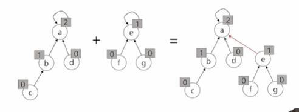
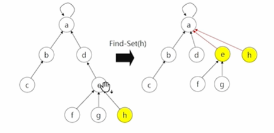

# 서로소 집합 (Disjoint-sets)
1. 정의
   2. 사로소 또는 상호배타 집한들은 서로 중복 포함된 원소가 없는 집합, 교집합이 없다
   3. 지한에 속한 하나의 특정 멤버를 통해 각 집합들을 구분한다. 이를 대표자라(representative)고함
2. 상호배타 집합을 표현하는 방법
   5. 연결 리스트
   6. 트리
3. 상호배타 연산
   8. make-set(x)
      9. 자기자신을 다 대표자로 설정, x개의 집합이 생성됨
      10. 예) a의 대표자를 a로, b의 대표자를 b로
   9. find-set(x)
      10. 대표자가 누구냐 물어보는 연산
   10. union(x,y)
       11. x,y를 하나의 집합으로 묶어주는 연산 (같은편 하자)
       12. 예) union(1,3) -> 이런 연산이 들어오면 같은 대표자를 가져야 같은 집합이니까, 3번자리 대표자를 1번으로 하는 거임

## 상호배타 집합에 대한 연산
1. 연산의 효율을 높이는 2가지 방법
   2. Rank를 이용한 union
      3. 각 노드는 자신을 루트로 하는 subtree의 높이를 랭크rank라는 이름으로 저장
      4. 두 집합을 합칠때 rank가 낮은 집합을 rank가 높은 집합에 붙임
      5. 예) 스타트업이 삼성과 합병할때 스타트업이 삼성에 들어간다. 그래야 대표자 바꾸는 등의 일이 수월해지니까
      6. 
   5. path compression (경로 압축)
      6. find-set을 행하는 과정에서 만나는 모든 노드들이 직접 root를 가리키도록 포인터를 바꾸어준다
      7. 

---
# path compression – 기본 vs 경로 압축

### 1. 기본 버전

```python
def find_set(x):
    if parents[x] == x:
        return x
    return find_set(parents[x])
```

- 대표자만 찾아감
- parents[x]는 여전히 중간 노드를 가리킬 수 있음

---

### 2. 경로 압축 버전

```python
def find_set(x):
    if parents[x] == x:
        return x
    parents[x] = find_set(parents[x])
    return parents[x]
```

- 대표자를 찾으면서
- 해당 경로에 있는 모든 노드를 대표자로 바로 연결함

---

### 차이 요약

| 구분 | 기본 버전 | 경로 압축 버전 |
|------|------------|----------------|
| 기능 | 대표자만 찾음 | 대표자로 직접 연결 |
| 시간복잡도 | O(log N) 수준 | 거의 O(1) 수준 (O(α(N))) |
| 최적화 | 없음 | 있음 (탐색 속도 향상) |

---

### 예시 비교 (parents = [0, 0, 1, 2, 3])

#### 기본 버전 호출 후
```text
find_set(4) → 0 (리턴됨)
parents = [0, 0, 1, 2, 3] (변화 없음)
```

#### 경로 압축 버전 호출 후
```text
find_set(4) → 0 (리턴됨)
parents = [0, 0, 0, 0, 0] (모두 대표자에 직접 연결됨)
```