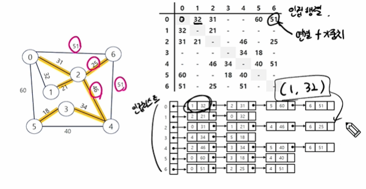
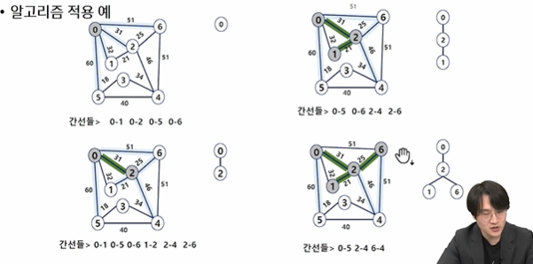
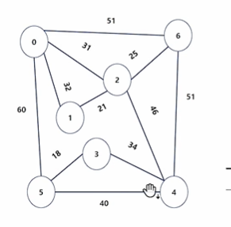

# 최소 비용 신장 트리 (MST)
1. 비용이라는 말은 가중치라는게 쓰인다는 말
2. 그래프에서 최소 비용 문제
   3. 모든 정점을 연결하는 간선들의 가중치 합이 최소가 되는 트리 : MST
   4. 두 정점 사이의 최소 비용의 경로 찾기 : 최단 거리
5. 신장 트리
   6. N개의 정점으로 이뤄진 무방향 그래프에서 N개의 정점과 N-1개의 간선으로 이뤄진 트리
7. 최소신장트리 (minimun spanning tree)
   8. 무방향(양방향) 가중치 그래프에서 신장 트리를 구성하는 간선들의 가중치의 합이 회소인 신장 트리
   9. 프림 : 양방향을 기준으로 특정 정점에서 출발해서 작은 것만 고른다
   10. 크루스칼 : 양방향 기준으로 작은 간선만 고른다
9. mst 표현
   10. 그래프나 트리로도 표현 가능
   10. 인접행렬 : 연결되는 부분에 가중치 숫자 바로 넣음
   11. 인접 리스트 : 튜플 리스트로 연결되는 점과 가중치를 제공
      
12. 구현 : 프림과 크루스칼 알고리즘으로 mst를 구현할 수 있음
    13. 프림 : 특정 정점을 기준으로 작은 것
    14. 크루스칼 : 간선들을 기준으로 작은 것 

---
[ 잠시 정리하고가기]
1. 신장트리
   2. 연결된 그래프 중
   3. 모든 정점을 연결
   4. 사이클이 없는 트리 (n이 2보다 클떄, n개의 정점과 n-1개의 간선으로 이뤄짐)
   5. 하나의 그래프에서 여러개가 나올 수 있음
6. 최소 비용 신장 트리
   7. 가중치의 합이 가장 작은 신장 트리
---
# Prim 알고리즘
1. 정의
   2. 하나의 정점에서 연결된 간선들중 하나씩 선택하면서 mst를 만들어감
      3. 임의의 정점을 하나 선택해서 시작
      4. 선택한 정점과 인접하는 정점들 중의 최소비용의 간선이 존재하는 정점을 선택
      5. 모든 정점이 선택될때까지 1,2번 반복 
6. 적용 예시
   
7. 코드 예시
   8. 아래 그림으로 푼 코드
   9. [예시 코드](basic_code/mst_prim.py)
   10. 일반적인 bfs랑 다른점
       11. for문으로 통해 주변을 둘러보면서 먼저 가는데를 먼저 방문처리를 했다면, 이건 우선숭뉘 즉 주변을 둘러보고 가장 작은 값을 가진 곳을 먼저가야하기에 -> for문으로 둘러본후 작은걸 뽑고 난뒤에 방문처리를 진행한다.

      
---
# Kruskal 알고리즘
1. 정의
   2. 간선을 하나씩 선택해서 mst를 찾는 알고리즘
   3. 최초, 모든 간선을 가중치에 따라 오름차순으로 정렬
   4. 가중치가 가장 낮은 간선부터 선택하면서 트리를 증가시킴
      5. 사이클이 존재하면 다음으로 가중치가 낮은 간선 선택
      6. 유니온파인드로 같은 집합끼리 연결하면 사이클이 발생한다는 거 알 수 있음
   6. n-1개의 간선이 선택될때까지 2번을 바로위의 단계 반복
   7. 특징
      8. 최소값은 항상 동일하나, 연결한 노드는 접근방식에 따라 다를수 있다. 노드를 보는게 아니라 가장 작은 수를 찾아다니는거니까
7. 코드 예시
   8. 
   9. [예시 코드](basic_code/mst_Kruskal.py)

---
## 프림 vs 크루스칼 알고리즘 비교 (MST)

| 항목 | 프림 알고리즘 | 크루스칼 알고리즘 |
|------|----------------|--------------------|
| 공통점 | MST(최소 신장 트리) 생성 | MST(최소 신장 트리) 생성 |
| 방식 | 정점 기준으로 확장 | 간선 기준으로 연결 |
| 자료구조 | 우선순위 큐 (heapq) | 간선 정렬 + 유니온 파인드 |
| 시간복잡도 | O((V + E) log V)   → 일반적으로 O(E log V) | O(E log E) |
| 어디서 시간 걸림? | 모든 간선을 확인하며 우선순위 큐 관리 | 간선 정렬 + 유니온 파인드 연산 |
| 유리한 상황 | 간선이 적을 때 | 간선이 적당히 많거나 정점 수가 적을 때 |
| 특징 | 시작 정점에서 출발 (연결된 노드만 고려) | 모든 간선을 미리 정렬 후, 사이클 없이 연결 |

