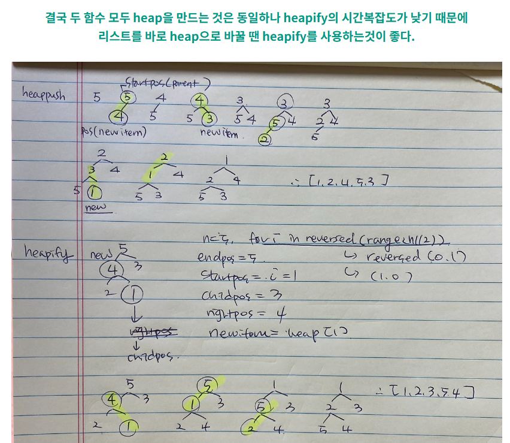
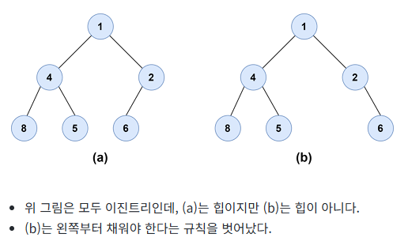
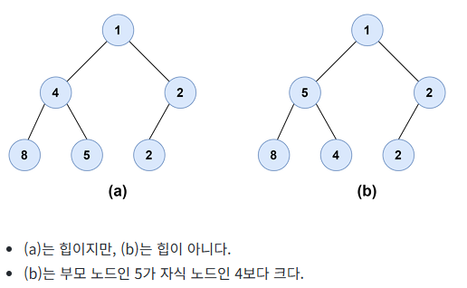
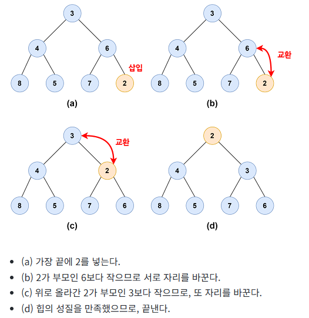

### 링크
https://wikidocs.net/194546

### 링크
https://docs.python.org/ko/3.13/library/heapq.html#basic-examples


https://ninefloor-design.tistory.com/216


# heap이란?
1. 큐란?
   - 선입선출 자료구조, 먼저 들어온 데이터가 먼저 나감
   - 우선순위 큐는 들어온 순서와 상관없이 우선순위가 높은 데이터가 먼저 나가는 자료구조
   - 최소힙에서 우선순위가 높다는 것은 가장 작은 값을 말함.
1. 정의
   - 힙은 우선순위 큐를 구현하기 위한 자료 구조
   - 쌓아올리다, 쌓아올린 더미의 의미를 가짐
   - 힙은 이진트리 형태로 구성되며 다음과 같은 규칙이 있음
   -  [규칙 1]
     - 노드를 왼쪽에서 오른쪽으로 하나씩 빠짐없이 채운다.
     - 
   - [규칙 2]
   - 최소힙은 부모노드가 자식노드 값보다 작거나 같아야함
   - 파이선의 힙 모듈은 최소 힙으로 (최대힙은 부모노드가 자식노드값보다 크거나 같음)
   - 
---
# 파이선의 heapq 모듈 구현하기
- 파이선의 힙 모듈은 배열(리스트)를 이용해, 완전이진트리를 구현
- 완전이진트리는 왼쪽부터 빈곳 없이 차례대로 채움
- [종류]
  - heappush(heap, data) : 힙에 새로운 데이터를 삽입
  - heappop(heap) : 힙에서 루트 노드(최솟값을 꺼낸 후 삭제)
  - heapify(x) : 주어진 배열을 힙 구조로 변환 (딸깍으로 만들어줌)
---
## heappush 구현하기
1. 정의
   - 이미 힙구조를 가진 배열의 끝에 새로운 원소를 넣는 함수
   - 추가된 원소가 부모보다 작으면 최소힙구조가 아니니까 부모와 자리를 바꾼다. 부모보다 작아지는 위치로 갈때까지 반복해서 이동한다.
   - 
2. 구현을 위한 과정
   - 배열 끝에 새 값을 추가 
   - 추가한 원소의 인덱스를 구함
   - 부모 인덱스를 구하여 값을 비교
   - 새 값이 부모의 값보다 작으면 값을 교환(인덱스를 갱신, 자리를 바꿈으로서 새로 추가한 인덱스가 변했음)
   - 새 값이 부모의 값보다 크거나 같을떄까지 위의 행동을 반복
3. 코드
```python
def heappush(heap, data):
    heap.append(data)
    # 추가한 원소의 인덱스를 구한다.
    current = len(heap) - 1
    # 현재 원소가 루트(인덱스 0)에 도달하면 종료
    while current > 0:
        # 추가한 원소의 부모 인덱스를 구한다.
        parent = (current - 1) // 2
        if heap[parent] > heap[current]:
            heap[parent], heap[current] = heap[current], heap[parent]
            # 추가한 원소의 인덱스를 갱신한다.
            current = parent
        else:
            break


#테스트 코드
import heapq
h1 = [3, 4, 6, 8, 5, 7]
h2 = [3, 4, 6, 8, 5, 7]
heappush(h1, 2)
heapq.heappush(h2, 2)
print(f"힙 {h1}에 2를 추가한 결과")
print("구현한 함수의 결과: ", h1)
print("heapq 메서드의 결과:", h2)
print()
heappush(h1, 3)
heapq.heappush(h2, 3)
print(f"힙 {h1}에 3을 추가한 결과")
print("구현한 함수의 결과: ", h1)
print("heapq 메서드의 결과:", h2)

```
---
## heappop 구현하기
1. 코드
2. 작동방식, 왜 마지막 노드로 대체하는걸까?
   - 이유 1
     - 완전이진트리 구조를 유지하기위해 (왼쪽부터 차곡 쌓이게)
     - 루트를 지우고 자식노드로 대체하게되면 완전이진트리의 구조가 깨져버림
     - 맨 마지막 노드의 값이 가장 큰건 맞는데, 맨 마직막 노드를 루트노드에 넣어야


# 힙 인덱스 기준별 부모/자식 노드 인덱스 정리

힙(Heap) 자료구조에서 **부모 노드와 자식 노드의 인덱스를 계산하는 방식**은
배열이 **0번 인덱스부터 시작하느냐, 1번 인덱스부터 시작하느냐**에 따라 달라진다.

---

## ✅ 힙 인덱스 기준별 공식 비교

| 인덱스 기준               | 부모 노드 인덱스       | 왼쪽 자식 인덱스    | 오른쪽 자식 인덱스   |
|---------------------------|-------------------------|----------------------|----------------------|
| **0부터 시작** (`heapq` 등) | `(i - 1) // 2`          | `2 * i + 1`          | `2 * i + 2`          |
| **1부터 시작** (직접 구현 등) | `i // 2`                | `2 * i`              | `2 * i + 1`          |

---

## 🔍 예시

### ▶️ 0부터 시작 (`heapq` 등)
```python
# 배열: 인덱스 기준 0부터 시작
arr = [5, 10, 15, 20, 25, 30]
# i = 2 일 때:
parent = (2 - 1) // 2 = 0      # 부모는 0번 인덱스 (값 5)
left_child = 2 * 2 + 1 = 5     # 왼쪽 자식은 5번 인덱스 (값 30)
right_child = 2 * 2 + 2 = 6    # 오른쪽 자식은 존재하지 않음 (index error)
```

### ▶️ 1부터 시작 (직접 구현)
```python
# 배열: 인덱스 기준 1부터 시작 (0번은 사용 안 함)
arr = [None, 5, 10, 15, 20, 25, 30]
# i = 3 일 때:
parent = 3 // 2 = 1           # 부모는 1번 인덱스 (값 5)
left_child = 2 * 3 = 6        # 왼쪽 자식은 6번 인덱스 (값 30)
right_child = 2 * 3 + 1 = 7   # 오른쪽 자식은 없음
```
---
# heap과 heapqfiy로 그려지는 트리의 차이점
## + 아이패드로 그린 만들어지는 과정 넣기

---
# heap과 heapqfiy 코드로 구현하기