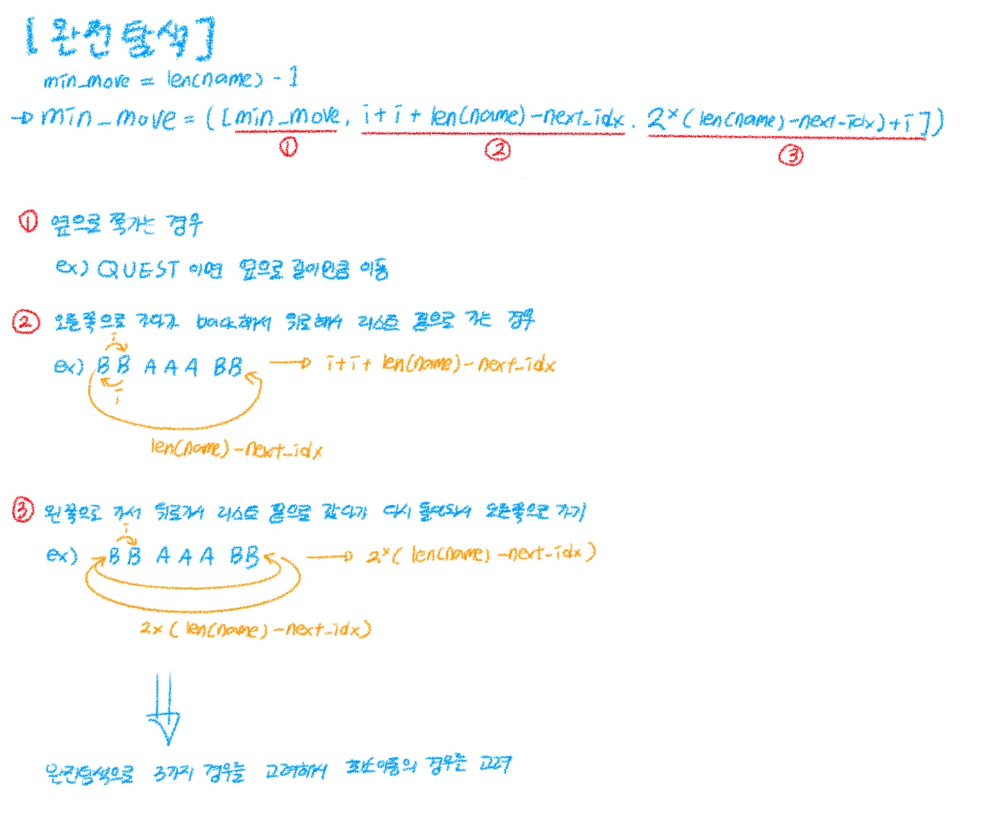

## 문제 설명
- 주어지는 단어를 모두 A로 바꾸기위한 최소이동&최소변화 수를 구하라
- chr,ord를 사용해서 모든 알파벳을 a로 바꾸기위해 위로 또는 아래로 이동하는 최소값과 문자열에서 오른쪽 왼쪽으로 이동하는 최소 이동 값을 구해야하는 거임
## 코드 설명
- 완전탐색은 아닌 부분탐색+그리디 -> 탐색 가능한 모든 경우 중 '규칙적으로 좋은 경우만' 계산해서 최소를 찾는 방식
- 문자열에서 이동할 수 있는 경우의 수를 고려해서 언제가 가장 적게 이동하는지를 구하는 거임

- 코드 설명 이미지


```python
import sys
sys.stdin = open("input.txt")

def solution(name):
  # 조이스틱 조작 횟수
  answer = 0

  # 기본 최소 좌우이동 횟수는 길이 - 1
  min_moves = len(name) - 1

  for i, char in enumerate(name):
      # print(i,char)
      # i : 인덱스, char : 문자열

      # 해당 알파벳 변경 횟수 추가
      answer += min(ord(char) - ord('A'), ord('Z') - ord(char) + 1)

      # 해당 알파벳 다음부터 연속된 A 찾기
      next_idx = i + 1
      while next_idx < len(name) and name[next_idx] == 'A':
          next_idx += 1

      # 1. min_moves : 기존,
      # 2. i + i + len(name) - next_idx : 연속된 A의 왼쪽시작 방식
      # 3. 2 * (len(name) - next_idx) + i : 연속된 A의 오른쪽시작 방식 비교

      # i: 현재 위치, next_idx: 다음 알파벳 위치, len(name): 문자열 전체 길이
      # i+i+len(name)-next_idx: 현재 위치에서 되돌아가서 다음 알파벳 위치로 가는 경우
      min_moves = min([min_moves, i + i + len(name) - next_idx, 2 * (len(name) - next_idx) + i])

  # 알파벳 변경(상하이동) 횟수에 좌우이동 횟수 더하기
  answer += min_moves

  return answer

word = input()
print(solution(word))
```


